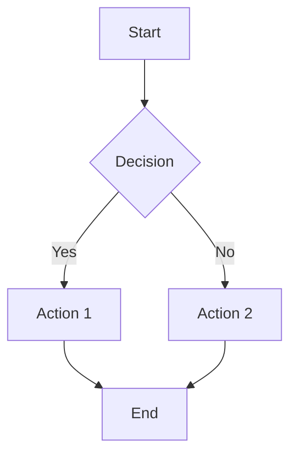
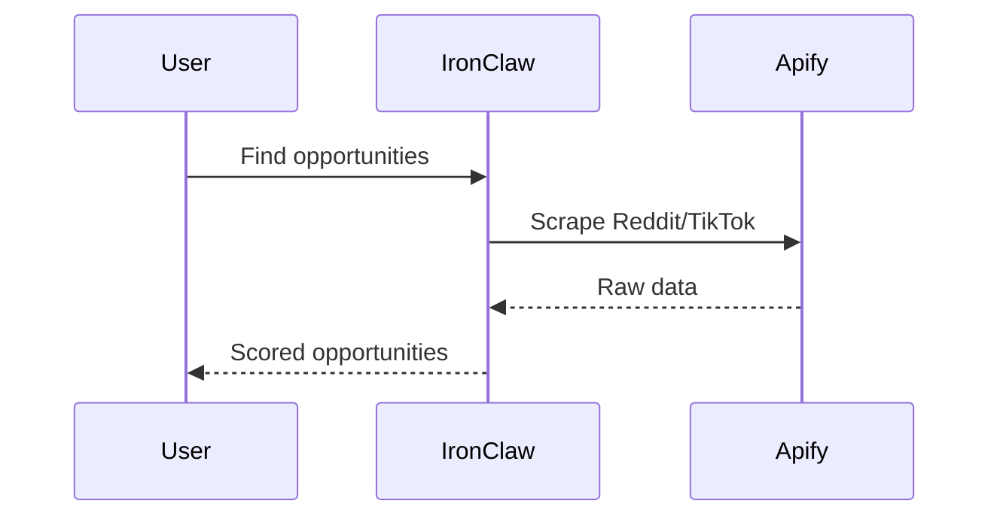
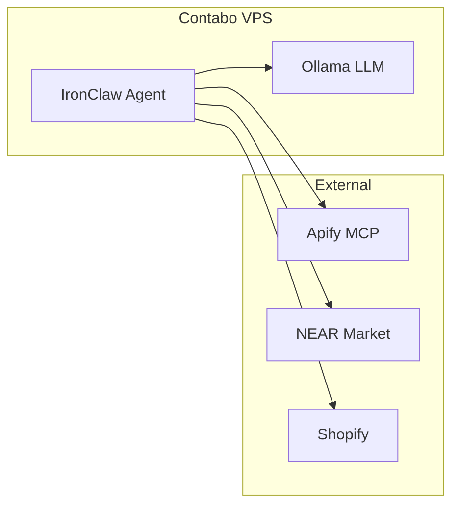
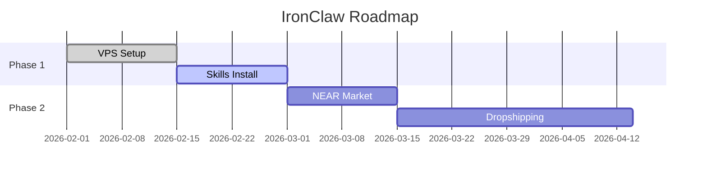
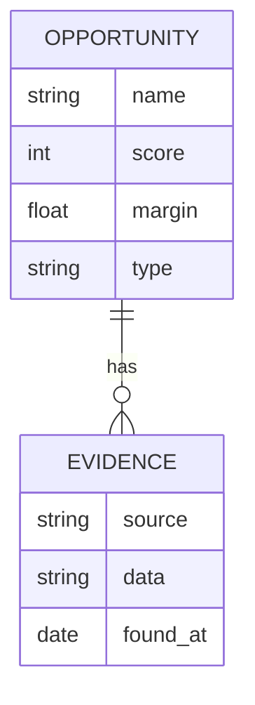
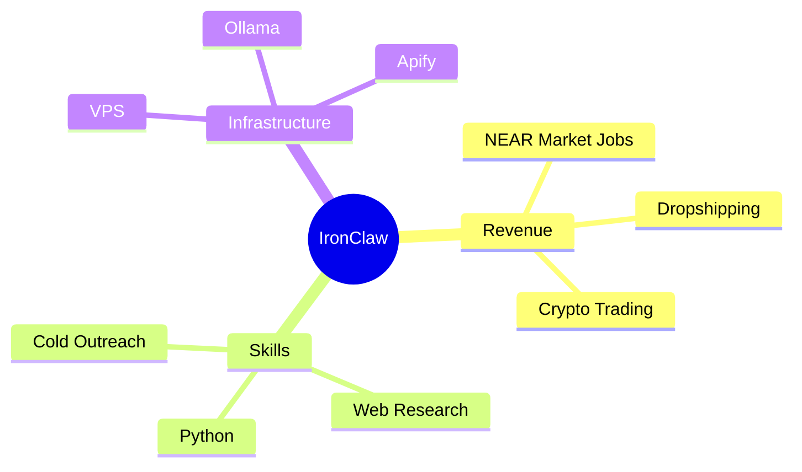
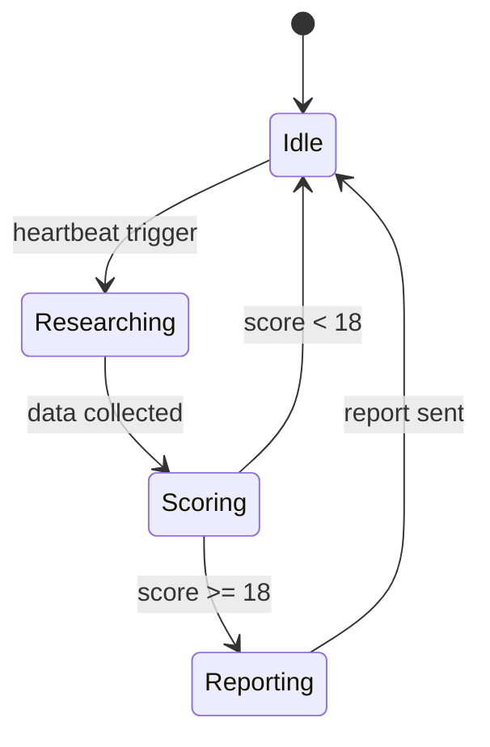

# Mermaid Generator Skill

Generate Mermaid diagrams. Always wrap output in a ```mermaid code block.

## Diagram Types

### Flowchart


### Sequence Diagram


### Architecture (C4 / flowchart style)


### Gantt Chart


### Entity Relationship


### Mind Map


### State Diagram


## Rules
- Always use valid Mermaid syntax — test mentally before outputting
- Keep node labels short (max 4 words)
- Use subgraphs to group related components
- For complex systems, break into multiple focused diagrams
- Add a plain-English summary below each diagram
